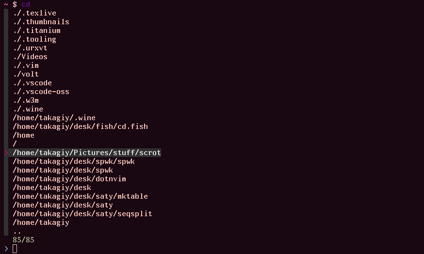

# cd.fish - Fish *cd* with history

## Overview



## Requirements

* [`fzf`](https://github.com/junegunn/fzf)
* GNU coreutils and GNU findutils (probably you already have)
  * `realpath`
  * `seq`
  * `find`

## Installation

### With [fisher](https://github.com/jorgebucaran/fisher)

```console
fisher add takagiy/cd.fish
```
